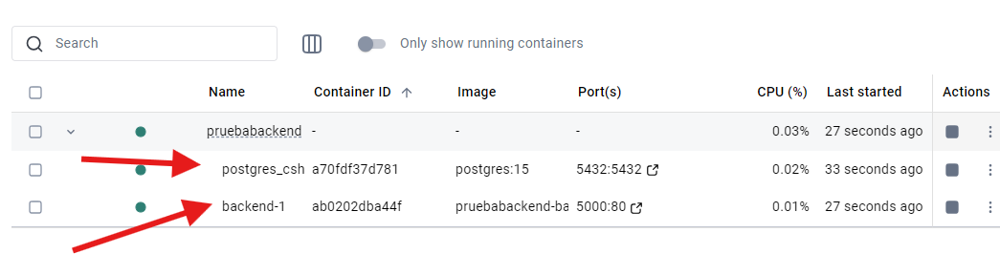
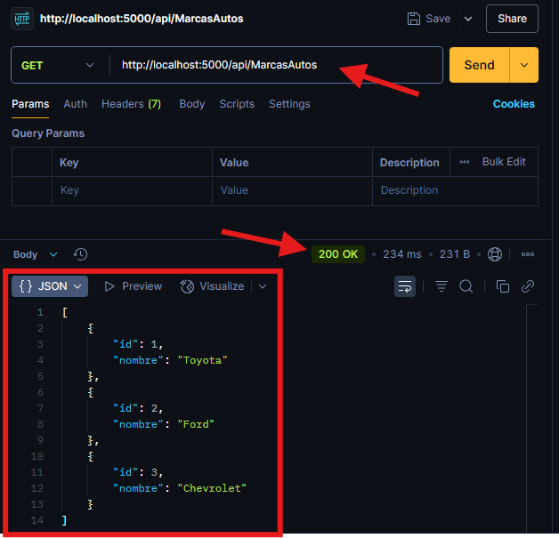

# PruebaBackend

Este es un proyecto backend desarrollado con **.NET 8**, pensado como parte de una prueba técnica o base para futuros desarrollos. Utiliza contenedores Docker para su ejecución y facilita el desarrollo gracias a Visual Studio.

---
## Screenshots Docker/Postman 


---

## 📦 Tecnologías utilizadas

- [.NET 8](https://dotnet.microsoft.com/)
- [Docker](https://www.docker.com/)
- Visual Studio 2022
- C#

## Cómo ejecutar el proyecto

### 1. Clonar el repositorio

```bash
git clone https://github.com/diegool2121/PruebaBackendC.git
```
### 2. Compilación del proyecto
```bash
dotnet build
```
### 3. Ejecutar con Docker
Asegurarse de tener Docker Desktop corriendo y ejecutar:

```bash
docker-compose up --build
```
### 4. Endpoint
```bash
http://localhost:5000/api/MarcasAutos
```
